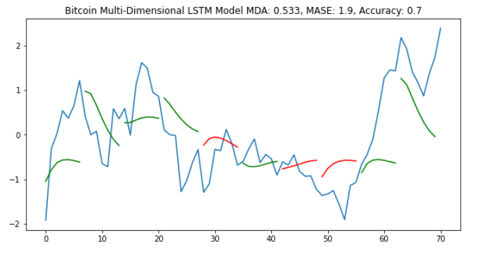
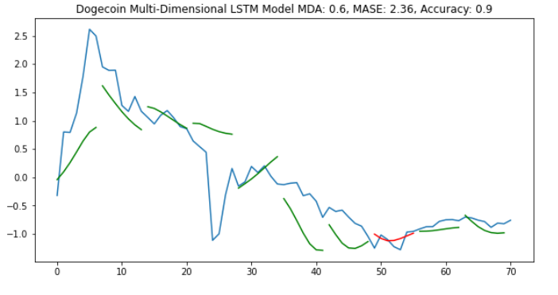

# Cryptocurrency Investments

## Problem Identification

Cryptocurrency coins are digital assets designed to work as a medium of exchange where ownership records are transactions stored in a blockchain ledger using strong cryptography. Cryptocurrencies typically use decentralized control as opposed to centralized digital currency and central banking systems. Bitcoin was the first decentralized cryptocurrency formed in 2009 and dominates the market with $903.5B market capitalization as of October 2021.

The goal of this project was to utilize technical analysis and social media metrics to identify buy, hold and sell opportunities for short-term holding periods. For this project to limit the scope of the analysis, I focused on the Bitcoin and Dogecoin coins.

## Data Source

[LunarCRUSH](https://lunarcrush.com/about) was founded in 2018 and is a cryptocurrency focused platform that delivers community insights to investors, funds, and exchanges. “Through resource applications and API's, get real-time insights that help make informed crypto investment decisions."  I will be using the assets API endpoint and technical analysis metrics/indicators from the [TA-Lib3](https://mrjbq7.github.io/ta-lib/) python wrapper.

## Data Cleaning

[Data Wrangling Notebook](https://colab.research.google.com/github/dcyoung23/crypto-investments/blob/main/notebooks/data_wrangling.ipynb)

Based on the timeframe that [LunarCRUSH](https://lunarcrush.com/about) has been in existence and the vast number of metrics available in the asset’s endpoint (62 variables), I had some skepticism that some metrics may not be very reliable for my use case. Therefore, I conducted a thorough analysis of missing values specifically when and how many values were missing.  Several columns were no longer being populated so I removed those from further analysis. It was also observed multiple columns were missing values at the beginning of the time series. This is consistent with new fields being added to the endpoint but not populated retroactively. I didn’t want to just remove data points for a variable that I may not even end up using in the modeling phase, so I decided to keep the blanks in the intermediate data files.

## Exploratory Data Analysis

[Exploratory Data Analysis Notebook](https://colab.research.google.com/github/dcyoung23/crypto-investments/blob/main/notebooks/exploratory_data_analysis.ipynb)

Technical analysis is the term used to evaluate investments and identify trading opportunities based on trends and patterns.  I explored 20 different metrics including Bollinger Bands, exponential and weighted moving averages, momentum indicators such as the Moving Average Convergence/Divergence (MACD) and the Relative Strength Index (RSI), and Pearson's correlation coefficient and linear regression.  My objective was to identify which metrics could be used to identify bullish and bearish market sentiment.

Social influence on cryptocurrency coins was the primary motivation for this project and research in this space landed me on the LunarCRUSH product. Twitter data was my primary interest but building out an entire data feed for tweets really was not feasible for the timeline of the project. LunarCRUSH is a paid product but based on the wide variety of features it offers it made sense for the timeline.  The assets endpoint has 62 columns including open, high, low, and close (OHLC) price data for over 2817 coins, tweet metrics, overall social market activity metrics and other proprietary score metrics.

The ultimate goal of this project was to predict the trend and recommend an investment decision. I created a new algorithm to determine buy/hold/sell decisions based on a forward-looking window:

Buy
1. Maximum gain during the window is > the desired threshold
2. Change in close price from the start to end of window is higher (window candle is green)
3. Lowest price during the window is >= the low price for the current day

Sell
1. Maximum loss during the window is < the desired threshold
2. Change in close price from the start to end of window is lower (window candle is red)
3. Highest price during the window is <= the high price for the current day

If either the buy or sell logic is not true, then the recommended decision is Hold.  The visual below shows the Bitcoin close price from January 2021 to August 2021 and the respective buy/hold/sell decision based on the above algorithm.

## Preprocessing and Modeling

### Preprocessing

[Preprocessing Modeling Notebook](https://colab.research.google.com/github/dcyoung23/crypto-investments/blob/main/notebooks/preprocessing_modeling.ipynb)

The first step was to engineer a variety of features identified during EDA such as rolling mean, standard deviation and percent change on several key social media metrics.  Next I evaluated several normalization methods:

1. Min-Max Normalization (Global)
2. Standardization by removing mean and scaling to unit variance (Global and Window)
3. % Change normalization (Global and Window)

Standard window scaling normalized the data the best for both coins.  % Change window scaling normalized the data very well for Bitcoin but since Dogecoin did not really have large changes in price until 2021 this scaling method was not as effective for Dogecoin.

### Modeling

My original vision for this project was to explore multiple deep learning techniques including:

1. Time series modeling using Long short-term memory (LSTM) recurrent neural networks (RNN) 
2. Classification using deep convolutional neural networks (CNN).  

This research [article](https://www.researchgate.net/publication/324802031_Algorithmic_Financial_Trading_with_Deep_Convolutional_Neural_Networks_Time_Series_to_Image_Conversion_Approach) was the inspiration for the time series to image conversion approach.  I will revisit using CNNs at a later date so for my Springboard capstone project I focused on sequence modeling using RNNs.

The baseline model was a simple one-dimensional LSTM using the close price to predict the future sequence.  Due to stochastic nature of a RNN model training, the results can vary for each run so I trained multiple models to average the evaluation metrics for both coins.  The primary evaluation metric I used was a custom evaluation metric based on directional trend analysis. The objective was to be able to predict the correct directional change while also being able to identify large % increase or decreases.  The mean sequence accuracy was 0.49 and 0.62 for Bitcoin and Dogecoin respectively.

Next I evaluated multiple multi-dimensional LSTM models but using a brute force approach to identify which features improved the baseline model.  This phase of the project was a challenge because I had a hard time finding a more streamlined way to perform feature selection for a LSTM model.  As a result the process was a little time consuming and I used some human judgment on the final variables selected for each coin.

The final Bitcoin model included close, linear regression, percent change 24h rank, social volume 24h rank and tween sentiment bullish and improved sequence accuracy to 0.7.

The final Dogecoin model included close, linear regression, market cap global percent change, social volume global mean and tween sentiment impact net mean and improved sequence accuracy to 0.9.

## Documentation

[Project Report](https://github.com/dcyoung23/crypto-investments/blob/main/reports/project_presentation.pdf)
[Project Presentation](https://github.com/dcyoung23/crypto-investments/blob/main/reports/project_presentation.pdf)

Please refer to my project report and presentation for a more detailed writeup of this project.

## Credits

I would like to give specific credit to Jakob Aungiers for his [blog](https://www.altumintelligence.com/articles/a/Time-Series-Prediction-Using-LSTM-Deep-Neural-Networks) on time series prediction using LSTM deep neural networks.  Here is a link to his GitHub [repository](https://github.com/jaungiers/LSTM-Neural-Network-for-Time-Series-Prediction).  I ended up making significant changes in my approach such as using standard window scaling instead of % change but this repository was a huge inspiration.

Finally, thank you to Kenneth Gil-Pasquel for being a great Springboard mentor.

