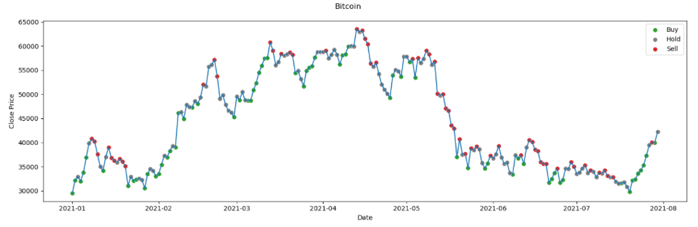

# Cryptocurrency Investments

## Problem Identification

Cryptocurrency coins are digital assets designed to work as a medium of exchange where ownership records are transactions are stored in a blockchain ledger using strong cryptography. Cryptocurrencies typically use decentralized control as opposed to centralized digital currency and central banking systems. Bitcoin was the first decentralized cryptocurrency formed in 2009 and dominants the market with $903.5B market capitalization as of October 2021.

The goal of this project is to utilize technical analysis and social media metrics to identify buy, hold and sell opportunities for short-term holding periods. For this project to limit the scope of the analysis, I will be focusing on Bitcoin and Dogecoin.

## Data Source

[LunarCRUSH](https://lunarcrush.com/about) was founded in 2018 and is a cryptocurrency focused platform that delivers community insights to investors, funds, and exchanges. “Through resource applications and API's, get real-time insights that help make informed crypto investment decisions."  I will be using the assets API endpoint and technical analysis metrics/indicators from the [TA-Lib3](https://mrjbq7.github.io/ta-lib/) python wrapper.

## Data Cleaning

Based on the timeframe that [LunarCRUSH](https://lunarcrush.com/about) has been in existence and the vast number of metrics available in the asset’s endpoint (62 variables), I had some skepticim that some metrics may not be very reliable for my use case. Therefore, I conducted a thorough analysis of missing values specifically when and how many values were missing.  Several columns were no longer being populated so I removed those from further analysis. It was also observed multiple columns were missing values at the beginning of the time series. This is consistent with new fields being added to the endpoint but not populated retroactively. I didn’t want to just remove data points for a variable that I may not even end up using in the modeling phase, so I decided to keep the blanks in the intermediate data files.

[Data Wrangling Notebook](./notebooks/data_wrangling.ipynb)

## Exploratory Data Analysis

The goal of this project is to predict the trend and recommend an investment decision. I created a new algorithm to determine buy/hold/sell decisions based on a forward-looking window:

Buy
1. Maximum gain during the window is > the desired threshold
2. Change in close price from the start to end of window is higher (window candle is green)
3. Lowest price during the window is >= the low price for the current day

*Sell
1. Maximum loss during the window is < the desired threshold
2. Change in close price from the start to end of window is lower (window candle is red)
3. Highest price during the window is <= the high price for the current day

If either the buy or sell logic is not true, then the recommended decision is Hold

Technical analysis is the term used to evaluate investments and identify trading opportunities based on trends and patterns.

Social influence on cryptocurrency coins was the primary motivation for this project and research in this space landed me on the LunarCRUSH product. Twitter data was my primary interest but building out an entire data feed for tweets really was not feasible for the timeline of the project. LunarCRUSH is a paid product but based on the wide variety of features it offers it made sense for the timeline.  The assets endpoint has 62 columns including open, high, low, and close (OHLC) price data for over 2817 coins, tweet metrics, overall social market activity metrics and other proprietary score metrics.

## Preprocessing

1. Min-Max Normalization (Global)
2. Standardization by removing mean and scaling to unit variance (Global and Window)
3. % Change normalization (Global and Window)

## Modeling

## Credits